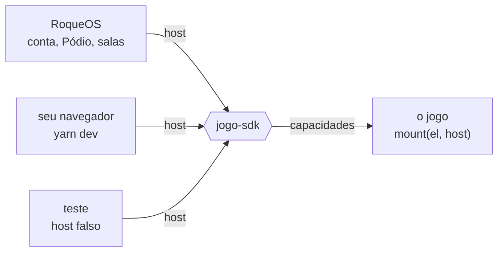

<p align="center">
  <a href="https://roqueos.com.br/jogos"></a>
</p>

Os jogos do [RoqueOS](https://roqueos.com.br), o sistema operacional que roda inteiro no
navegador. Cada jogo mora no próprio repositório, fala com o sistema só pelo
[`jogo-sdk`](https://github.com/roqueos-games/jogo-sdk) e tem o código aberto sob MIT. Todos
rodam de graça em [roqueos.com.br/jogos](https://roqueos.com.br/jogos), no computador, no
celular e na TV.

_English below._

## Os jogos

### Mundos

|                                                                                                                                      | Jogo                                                          | O que é                                                                                                             |                                                  |
| :----------------------------------------------------------------------------------------------------------------------------------: | ------------------------------------------------------------- | ------------------------------------------------------------------------------------------------------------------- | :----------------------------------------------: |
|  | [**RoqueCraft**](https://github.com/roqueos-games/roquecraft) | Mundo de blocos infinito: explore biomas, minere, construa e sobreviva, sozinho ou online com amigos.               | [Jogar](https://roqueos.com.br/jogar/roquecraft) |
|        | [**RagnaRoque**](https://github.com/roqueos-games/runa)       | Action-RPG isométrico 3D: escolha entre 4 classes, explore um mundo por portais, evolua com talentos e colete loot. |    [Jogar](https://roqueos.com.br/jogar/runa)    |

### Tabuleiro e mesa

|                                                                                                                                            | Jogo                                                              | O que é                                                                               |                                                        |
| :----------------------------------------------------------------------------------------------------------------------------------------: | ----------------------------------------------------------------- | ------------------------------------------------------------------------------------- | :----------------------------------------------------: |
|            | [**Xadrez**](https://github.com/roqueos-games/xadrez)             | Xadrez completo, jogue online por QR/código ou local no mesmo aparelho.               |      [Jogar](https://roqueos.com.br/jogar/xadrez)      |
|             | [**Damas**](https://github.com/roqueos-games/damas)               | Damas brasileiras, captura obrigatória e dama voadora, online por QR/código ou local. |      [Jogar](https://roqueos.com.br/jogar/damas)       |
|  | [**Velha 3D**](https://github.com/roqueos-games/jogo-da-velha-3d) | Jogo da velha em 3D num cubo 4×4×4 contra a IA, alinhe 4 em qualquer direção.         | [Jogar](https://roqueos.com.br/jogar/jogo-da-velha-3d) |
|            | [**Sinuca**](https://github.com/roqueos-games/sinuca)             | Sinuca 8-ball em 3D num bar, física real, contra a IA (com níveis) ou local.          |      [Jogar](https://roqueos.com.br/jogar/sinuca)      |

### Arcade 3D

|                                                                                                                                    | Jogo                                                      | O que é                                                                             |                                                |
| :--------------------------------------------------------------------------------------------------------------------------------: | --------------------------------------------------------- | ----------------------------------------------------------------------------------- | :--------------------------------------------: |
|  | [**SkyStack**](https://github.com/roqueos-games/skystack) | Jogo de empilhar blocos 3D: suba até o espaço, e cada erro deixa a torre mais fina. | [Jogar](https://roqueos.com.br/jogar/skystack) |
|    | [**PRISMA**](https://github.com/roqueos-games/prisma)     | Encaixe as peças 3D que caem e limpe linhas para pontuar.                           |  [Jogar](https://roqueos.com.br/jogar/prisma)  |
|      | [**TORA**](https://github.com/roqueos-games/tora)         | Encaixe blocos de madeira 3D e complete fileiras para limpá-las e passar de nível.  |   [Jogar](https://roqueos.com.br/jogar/tora)   |
|      | [**NOVA**](https://github.com/roqueos-games/nova)         | Salte de órbita em órbita e fuja da supernova que vem atrás, com física de verdade. |   [Jogar](https://roqueos.com.br/jogar/nova)   |
|       | [**EKO**](https://github.com/roqueos-games/eko)           | Plane por uma caverna escura onde só o eco revela as paredes.                       |   [Jogar](https://roqueos.com.br/jogar/eko)    |
|     | [**LUMEN**](https://github.com/roqueos-games/lumen)       | Guie um enxame de luzes vivas com flocking real e fuja das sombras.                 |  [Jogar](https://roqueos.com.br/jogar/lumen)   |
|     | [**Snake**](https://github.com/roqueos-games/snake)       | Cresça a cobra neon comendo, sem bater nas paredes ou na cauda.                     |  [Jogar](https://roqueos.com.br/jogar/snake)   |

### Clássicos 2D

|                                                                                                                                           | Jogo                                                            | O que é                                                                                                 |                                                       |
| :---------------------------------------------------------------------------------------------------------------------------------------: | --------------------------------------------------------------- | ------------------------------------------------------------------------------------------------------- | :---------------------------------------------------: |
|             | [**2048**](https://github.com/roqueos-games/2048)               | Deslize as peças, junte os números iguais e chegue à peça 2048.                                         |      [Jogar](https://roqueos.com.br/jogar/2048)       |
|         | [**Breakout**](https://github.com/roqueos-games/breakout)       | Rebata a bola, quebre todos os tijolos, faça combos e pegue power-ups.                                  |    [Jogar](https://roqueos.com.br/jogar/breakout)     |
|  | [**Memória**](https://github.com/roqueos-games/jogo-da-memoria) | Vire as cartas e encontre todos os pares no menor número de jogadas.                                    | [Jogar](https://roqueos.com.br/jogar/jogo-da-memoria) |
|             | [**NEXO**](https://github.com/roqueos-games/nexo)               | Trace uma única linha que liga os números em ordem e preenche todo o grid, puzzle procedural com fases. |      [Jogar](https://roqueos.com.br/jogar/nexo)       |

## Como um jogo fala com o RoqueOS

Nenhum jogo importa nada do sistema. Cada um exporta `mount(el, host)` e pede ao host só as
capacidades de que precisa: quem é o jogador, onde guardar o recorde, áudio, idioma, sala
online, progresso da conta, IA. O contrato é o
[`jogo-sdk`](https://github.com/roqueos-games/jogo-sdk), e por isso o mesmo jogo roda dentro
do RoqueOS, sozinho no seu navegador e no teste, sem saber em qual dos três está.



## Rodar um jogo na sua máquina

Precisa de Node 22 ou mais novo e do Yarn 1.22.

```sh
git clone https://github.com/roqueos-games/2048.git
cd 2048
yarn install --ignore-scripts
yarn dev
```

`yarn verificar` roda lint, formato, testes e o `jogo check`, o mesmo que o CI roda no pull
request.

## Participar

- Achou um bug ou tem uma ideia para um jogo? Abra uma issue no repo dele.
- Pergunta, sugestão ou vontade de mostrar o que construiu no RoqueCraft: use as
  [Discussions](https://github.com/orgs/roqueos-games/discussions).
- Quer mandar código? Cada repo tem o próprio `CONTRIBUTING.md`; a régua comum está em
  [CONTRIBUTING.md](https://github.com/roqueos-games/.github/blob/main/CONTRIBUTING.md) e o
  combinado de convivência em
  [CODE_OF_CONDUCT.md](https://github.com/roqueos-games/.github/blob/main/CODE_OF_CONDUCT.md).
- Falha de segurança não vai em issue pública: veja
  [SECURITY.md](https://github.com/roqueos-games/.github/blob/main/SECURITY.md).

## Licença

Código e arte própria sob MIT. Asset de terceiro segue a licença registrada no `ASSETS.md` de
cada repo. O RoqueOS em si é fechado, e alguns jogos dele também são; esses ficam fora desta
lista.

---

## English

The games of [RoqueOS](https://roqueos.com.br), an operating system that runs entirely in the
browser. Each game lives in its own repository, talks to the system only through the
[`jogo-sdk`](https://github.com/roqueos-games/jogo-sdk) and is open source under MIT. All of
them are free to play at [roqueos.com.br/jogos](https://roqueos.com.br/jogos), on desktop,
phone and TV.

<details>
<summary>The games</summary>

### Worlds

|                                                                                                                                      | Game                                                          | What it is                                                                                                     |                                                 |
| :----------------------------------------------------------------------------------------------------------------------------------: | ------------------------------------------------------------- | -------------------------------------------------------------------------------------------------------------- | :---------------------------------------------: |
|  | [**RoqueCraft**](https://github.com/roqueos-games/roquecraft) | Infinite block world: explore biomes, mine, build and survive, solo or online with friends.                    | [Play](https://roqueos.com.br/jogar/roquecraft) |
|        | [**RagnaRoque**](https://github.com/roqueos-games/runa)       | A 3D isometric action-RPG: pick one of 4 classes, explore a world through portals, grow with talents and loot. |    [Play](https://roqueos.com.br/jogar/runa)    |

### Board and table

|                                                                                                                                            | Game                                                                    | What it is                                                                          |                                                       |
| :----------------------------------------------------------------------------------------------------------------------------------------: | ----------------------------------------------------------------------- | ----------------------------------------------------------------------------------- | :---------------------------------------------------: |
|            | [**Chess**](https://github.com/roqueos-games/xadrez)                    | Full chess, play online by QR/code or locally on one device.                        |      [Play](https://roqueos.com.br/jogar/xadrez)      |
|             | [**Checkers**](https://github.com/roqueos-games/damas)                  | Brazilian draughts, mandatory capture and flying kings, online by QR/code or local. |      [Play](https://roqueos.com.br/jogar/damas)       |
|  | [**3D Tic-Tac-Toe**](https://github.com/roqueos-games/jogo-da-velha-3d) | 3D tic-tac-toe on a 4×4×4 cube against the AI, line up four in any direction.       | [Play](https://roqueos.com.br/jogar/jogo-da-velha-3d) |
|            | [**8-Ball Pool**](https://github.com/roqueos-games/sinuca)              | 3D 8-ball pool in a bar, real physics, vs the AI (with levels) or local.            |      [Play](https://roqueos.com.br/jogar/sinuca)      |

### 3D arcade

|                                                                                                                                    | Game                                                      | What it is                                                                |                                               |
| :--------------------------------------------------------------------------------------------------------------------------------: | --------------------------------------------------------- | ------------------------------------------------------------------------- | :-------------------------------------------: |
|  | [**SkyStack**](https://github.com/roqueos-games/skystack) | 3D block-stacking game, climb all the way to space.                       | [Play](https://roqueos.com.br/jogar/skystack) |
|    | [**PRISMA**](https://github.com/roqueos-games/prisma)     | Fit the falling 3D blocks and clear lines to score.                       |  [Play](https://roqueos.com.br/jogar/prisma)  |
|      | [**TORA**](https://github.com/roqueos-games/tora)         | Fit 3D wooden blocks and complete lines to clear them and level up.       |   [Play](https://roqueos.com.br/jogar/tora)   |
|      | [**NOVA**](https://github.com/roqueos-games/nova)         | Slingshot from orbit to orbit and outrun the supernova.                   |   [Play](https://roqueos.com.br/jogar/nova)   |
|       | [**EKO**](https://github.com/roqueos-games/eko)           | Glide through a pitch-black cave where only echoes reveal the walls.      |   [Play](https://roqueos.com.br/jogar/eko)    |
|     | [**LUMEN**](https://github.com/roqueos-games/lumen)       | Steer a living swarm of lights with real flocking and outrun the shadows. |  [Play](https://roqueos.com.br/jogar/lumen)   |
|     | [**Snake**](https://github.com/roqueos-games/snake)       | Grow the neon snake by eating, don't hit the walls or your tail.          |  [Play](https://roqueos.com.br/jogar/snake)   |

### 2D classics

|                                                                                                                                           | Game                                                           | What it is                                                                                               |                                                      |
| :---------------------------------------------------------------------------------------------------------------------------------------: | -------------------------------------------------------------- | -------------------------------------------------------------------------------------------------------- | :--------------------------------------------------: |
|             | [**2048**](https://github.com/roqueos-games/2048)              | Slide the tiles, merge matching numbers and reach the 2048 tile.                                         |      [Play](https://roqueos.com.br/jogar/2048)       |
|         | [**Breakout**](https://github.com/roqueos-games/breakout)      | Bounce the ball, smash every brick, chain combos and grab power-ups.                                     |    [Play](https://roqueos.com.br/jogar/breakout)     |
|  | [**Memory**](https://github.com/roqueos-games/jogo-da-memoria) | Flip the cards and match every pair in as few moves as possible.                                         | [Play](https://roqueos.com.br/jogar/jogo-da-memoria) |
|             | [**NEXO**](https://github.com/roqueos-games/nexo)              | Draw one line that links the numbers in order and fills the whole grid, a procedural puzzle with phases. |      [Play](https://roqueos.com.br/jogar/nexo)       |

</details>

A game exports `mount(el, host)` and asks the host only for the capabilities it needs
(player identity, high score storage, audio, language, online rooms, account progress, AI).
That contract is the `jogo-sdk`, so the same game runs inside RoqueOS, standalone in your
browser and in tests. To run one locally: Node 22+, Yarn 1.22, then
`yarn install --ignore-scripts` and `yarn dev`; `yarn verificar` runs the same checks as CI.

Issues and pull requests in English are welcome; code and comments are in Brazilian
Portuguese. Questions and ideas go to
[Discussions](https://github.com/orgs/roqueos-games/discussions); vulnerabilities go through
[SECURITY.md](https://github.com/roqueos-games/.github/blob/main/SECURITY.md), never a public
issue. Code and original art are MIT; third-party assets follow the license listed in each
repo's `ASSETS.md`.
