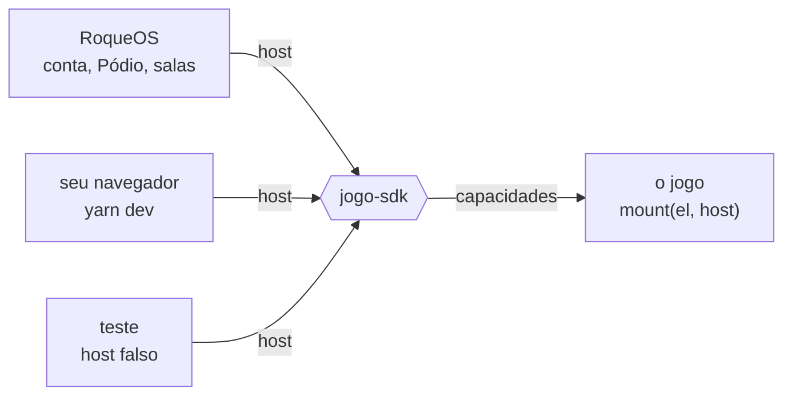

<p align="center">
  <a href="https://roqueos.com.br/jogos"></a>
</p>

Os jogos do [RoqueOS](https://roqueos.com.br), o sistema operacional que roda inteiro no
navegador. Cada jogo mora no próprio repositório, fala com o sistema só pelo
[`jogo-sdk`](https://github.com/roqueos-games/jogo-sdk) e tem o código aberto sob MIT. Todos
rodam de graça em [roqueos.com.br/jogos](https://roqueos.com.br/jogos), no computador, no
celular e na TV.

_English below._

## Os jogos

{{JOGOS_PT}}

## Como um jogo fala com o RoqueOS

Nenhum jogo importa nada do sistema. Cada um exporta `mount(el, host)` e pede ao host só as
capacidades de que precisa: quem é o jogador, onde guardar o recorde, áudio, idioma, sala
online, progresso da conta, IA. O contrato é o
[`jogo-sdk`](https://github.com/roqueos-games/jogo-sdk), e por isso o mesmo jogo roda dentro
do RoqueOS, sozinho no seu navegador e no teste, sem saber em qual dos três está.



## Rodar um jogo na sua máquina

Precisa de Node 22 ou mais novo e do Yarn 1.22.

```sh
git clone https://github.com/roqueos-games/2048.git
cd 2048
yarn install --ignore-scripts
yarn dev
```

`yarn verificar` roda lint, formato, testes e o `jogo check`, o mesmo que o CI roda no pull
request.

## Participar

- Achou um bug ou tem uma ideia para um jogo? Abra uma issue no repo dele.
- Pergunta, sugestão ou vontade de mostrar o que construiu no RoqueCraft: use as
  [Discussions](https://github.com/orgs/roqueos-games/discussions).
- Quer mandar código? Cada repo tem o próprio `CONTRIBUTING.md`; a régua comum está em
  [CONTRIBUTING.md](https://github.com/roqueos-games/.github/blob/main/CONTRIBUTING.md) e o
  combinado de convivência em
  [CODE_OF_CONDUCT.md](https://github.com/roqueos-games/.github/blob/main/CODE_OF_CONDUCT.md).
- Falha de segurança não vai em issue pública: veja
  [SECURITY.md](https://github.com/roqueos-games/.github/blob/main/SECURITY.md).

## Licença

Código e arte própria sob MIT. Asset de terceiro segue a licença registrada no `ASSETS.md` de
cada repo. O RoqueOS em si é fechado, e alguns jogos dele também são; esses ficam fora desta
lista.

---

## English

The games of [RoqueOS](https://roqueos.com.br), an operating system that runs entirely in the
browser. Each game lives in its own repository, talks to the system only through the
[`jogo-sdk`](https://github.com/roqueos-games/jogo-sdk) and is open source under MIT. All of
them are free to play at [roqueos.com.br/jogos](https://roqueos.com.br/jogos), on desktop,
phone and TV.

<details>
<summary>The games</summary>

{{JOGOS_EN}}

</details>

A game exports `mount(el, host)` and asks the host only for the capabilities it needs
(player identity, high score storage, audio, language, online rooms, account progress, AI).
That contract is the `jogo-sdk`, so the same game runs inside RoqueOS, standalone in your
browser and in tests. To run one locally: Node 22+, Yarn 1.22, then
`yarn install --ignore-scripts` and `yarn dev`; `yarn verificar` runs the same checks as CI.

Issues and pull requests in English are welcome; code and comments are in Brazilian
Portuguese. Questions and ideas go to
[Discussions](https://github.com/orgs/roqueos-games/discussions); vulnerabilities go through
[SECURITY.md](https://github.com/roqueos-games/.github/blob/main/SECURITY.md), never a public
issue. Code and original art are MIT; third-party assets follow the license listed in each
repo's `ASSETS.md`.
